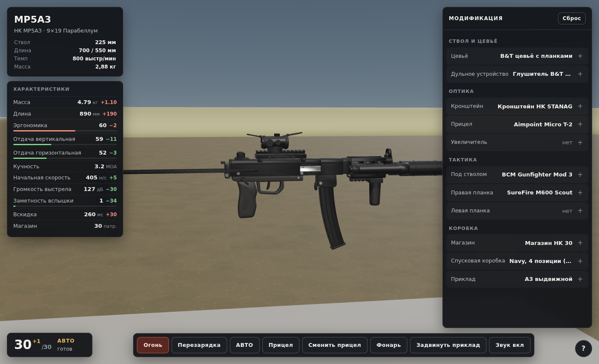
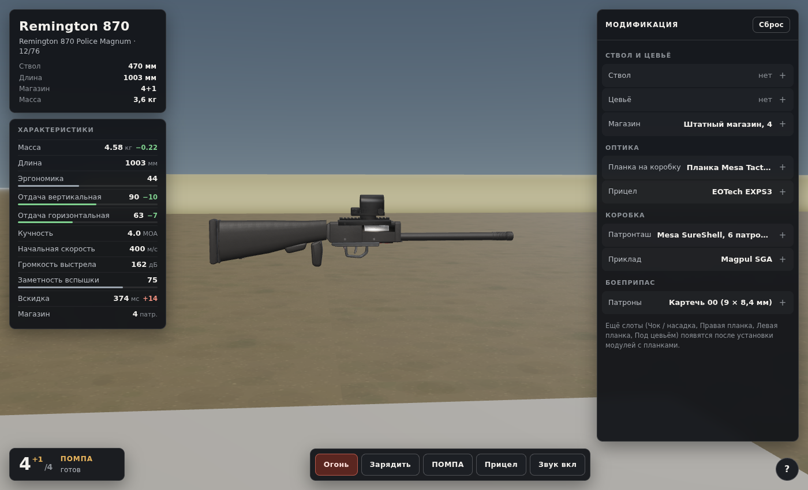
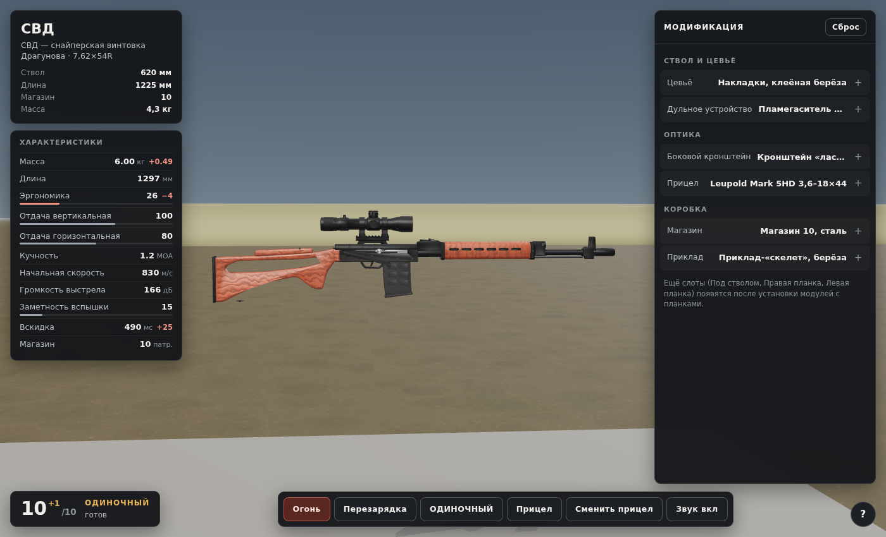
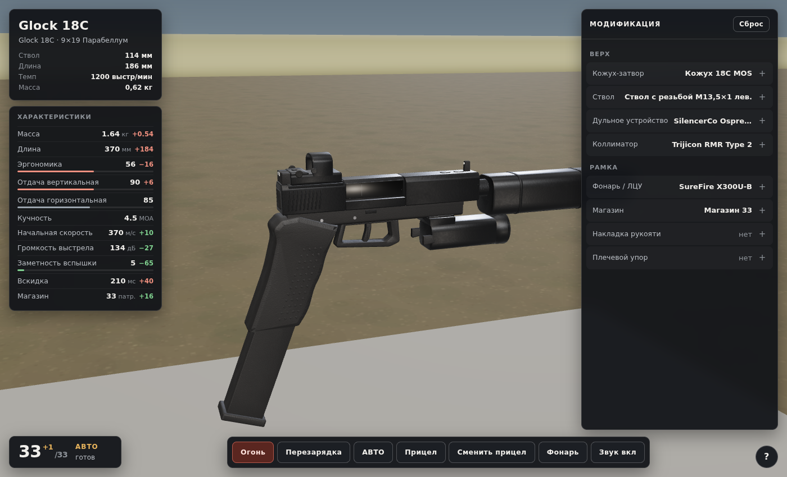

# ANGAR-07 · ALPHA vs DELTA

Карта-шутхаус в ангаре на three.js + **Bullet Physics (ammo.js)**. Каркасное здание из OSB,
две базы команд с флагами, укрытия, полностью разрушаемое дерево и стекло, огонь, взрывы.

## Запуск

Весь код — в одном файле **`angar_map.html`**: код карты, библиотека Bullet (ammo.js) и её wasm
вшиты внутрь. Файл можно открыть двойным кликом, но нужен интернет — three.js грузится с unpkg.
Качество задаётся параметром в адресе: `angar_map.html?q=high` (`low | med | high | ultra`).

## Управление

| Клавиша | Действие | Клавиша | Действие |
|---|---|---|---|
| WASD / Shift | движение / бег | ЛКМ / ПКМ | огонь / прицел |
| Space / C | прыжок / присесть | R | перезарядка |
| G | осколочная граната | T | зажигательная бутылка |
| F | полёт-наблюдатель ↔ ходьба | M / Esc | меню: команда и точка возрождения |
| N / P / [ ] | фаза суток / пауза времени / скорость | F3 | счётчик FPS |

## Что внутри

- **Физика** — Bullet (ammo.js из присланного архива, вшит в конец файла): статический мир из ориентированных боксов,
  персонаж — `btKinematicCharacterController` (капсула, шаг по ступеням, уклоны), обломки — rigid body,
  флаги — soft body (сетка узлов, ветер давит на каждый треугольник по нормали), гранаты с CCD.
- **Разрушаемость** (раздел «РАЗРУШАЕМОСТЬ»)
  - Обшивка OSB — листы 1.22×2.44, разрезанные на куски с «дрожащими» узлами сетки: пробоина рваная.
    Пуля оставляет входное/выходное отверстие и щепу, очередь прорезает щель, взрыв вырывает куски.
    Коллайдер листа перестраивается из оставшихся кусков — в дыру можно пролезть и простреливать.
    Куски, потерявшие связь с краем листа, падают.
  - Стойки, лаги, перемычки, перила — брус: ломается в точке удара на две половины с рваным торцом.
  - Стекло — звезда трещин, затем радиальные осколки: часть остаётся в раме, крупные падают телами.
  - Ящики, поддоны, баррикады, мишени разлетаются на доски; топливные бочки текут, горят и взрываются.
  - Пробитие: дерево и стекло пропускают пулю с потерей энергии, бетон/металл/мешки — нет.
- **Огонь** (раздел «ОГОНЬ») — очаги разгораются, обугливают древесину (шейдер: коричневый → уголь с
  «крокодиловой» коркой → тлеющие трещины), съедают прочность, перекидываются вверх и в стороны,
  прожигают стены насквозь; дым под кровлю, искры, свет пламени, треск.
- **Взрыв** — огненный шар, ударная волна по обломкам, флагам и игроку (с учётом укрытия),
  воронка в бетоне с валом крошки, гарь на стенах, контузия, звук с задержкой по скорости звука.
- **Карта** — здание 30×19 м, два этажа, атриум с мостиком, 2 внутренние деревянные и
  2 наружные стальные лестницы (все ведут к дверям), базы ALPHA (запад) и DELTA (восток) с
  навесами из габионов, по 3 точки возрождения, центрально-симметричные линии укрытий.
  Коридоры перегорожены дверями «вразбежку», в пролётах стоят S-образные заслоны из контейнеров:
  на уровне глаз нет ни одной прямой линии через всю карту.

`legacy/angar_map_original.html` — исходная версия карты для сравнения.

## Оружейная (`armory/`)

Модульные стенды на движке из шаблона `ak74_modular.html`: **HK MP5A3**, **Remington 870**, **СВД** и
**Glock 18C** — каждый в одном самодостаточном файле (`armory/*.html`, нужен интернет для three.js),
общий список — `armory/index.html`.

| Оружие | Что меняется |
|---|---|
| MP5A3 | цевьё (узкое / тропическое / B&T с планками / SureFire 628 с фонарём), 3-зацепные насадки и глушители B&T / Gemtech, кронштейн STANAG под прицелы, спусковые коробки SEF / Navy 0-1-3-F / 0-1, приклады A3 (выдвижной) / A2 / без приклада, магазины 15–40 и барабан 50 |
| Remington 870 | стволы 14" / 18,5" / 20" с винтовочными прицелами / 26" с планкой, чоки (цилиндр … полный), пробойный стенд-офф, Salvo 12, цевья (Express / орех / «бобровый хвост» / MOE M-LOK / DSF-фонарь), удлинители магазина +2/+3, планка на коробку, патронташ, приклады, патроны (картечь / дробь / пуля) |
| СВД | накладки (дерево / полимер / цевьё с планками), пламегаситель / ДТК / глушитель, ПСО-1, ПОСП 4–12×42, «Кобра», кронштейн на Пикатинни под любые прицелы (в т.ч. Mark 5HD, PM II), приклады (скелет, СВДС, СВДМ), магазины 10/20 |
| Glock 18C | кожух (18C / MOS / с тритием), ствол (с портами / гладкий / с резьбой), глушители Osprey / Obsidian, компенсатор, коллиматоры RMR / 507C / ACRO, фонари X300U / TLR-7A / TLR-8A, магазины 17–33 и барабан 50, накладки, плечевой упор |

Механика у каждого своя: HK-перезарядка (рукоять в вырез → магазин → удар ладонью), помпа с
заряжанием трубки по одному патрону и осыпью дроби по чоку, затвор СВД на задержке подавателя
(при снятом магазине уходит вперёд), кожух Glock на задержке, очередь по 3 у MP5 Navy.

Звуки механики синтезируются плотным набором быстро гаснущих неоднородных мод — без
тональных «колокольчиков», которые давали чистые синусоиды шаблона. Исправлена и ошибка шаблона
с прицелом: при фокусе на установленном прицеле камера учитывала плоскость сетки, вынесенную на
60 м вперёд, и улетала за стрельбище.

Исходники — `armory/src` (движок, общие модули, описания оружия), сборка: `node armory/build.mjs`.

| | |
|---|---|
|  |  |
|  |  |

## Скриншоты

| | |
|---|---|
|  |  |
|  |  |
|  |  |
|  |  |
|  |  |
